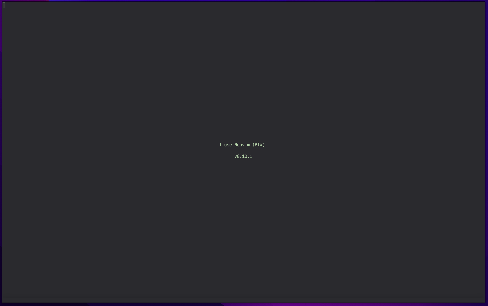

<h1 align="center">
    dotfiles-nvim
</h1>
<div align="center">
  
  
  
  <p>dotfiles v5</p>
</div>



## Directory Structure

```
.
├── flake.nix         # Nix flake configuration
├── apps.nix          # Application definitions
├── overlays.nix      # Nix overlays
├── assets/           # Documentation images
├── tests/            # Test configuration directory
└── v2/               # Main configuration directory
    ├── default.nix   # Nix configuration entry point
    ├── fnl/          # Fennel source files
    ├── lua/autogen/  # Compiled Lua files
    ├── lua/          # Lua source files
    ├── npins/        # Nix package management for v2
    ├── tmpl/         # Template files
    └── vim/          # Vim script configurations
```

