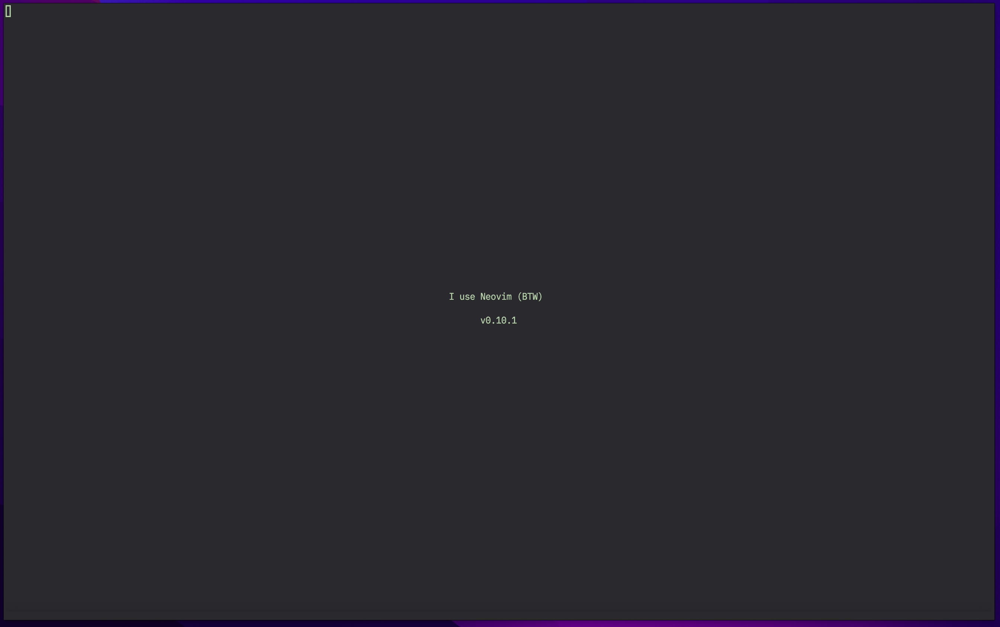

<h1 align="center">
    dotfiles-nvim
</h1>
<div align="center">
  
  
  
  <p>dotfiles v5</p>
</div>



## Platform support

The full `bundler-nvim-v2` package targets Apple Silicon macOS (`aarch64-darwin`):
meian and the packaged Kotlin LSP depend on macOS. Linux (`x86_64-linux`,
`aarch64-linux`) exposes development tools and portable checks, not the full package.
Intel macOS (`x86_64-darwin`) is no longer supported.

## CI checks

On pushes to main and pull requests, Linux and Apple Silicon macOS run
`nix flake check`: workflow lint and the seven isolated Mimori/Komado suites
(packaging, client, adapter, priority, labels, presentation snapshots, hover).
Tests use the pinned Komado plugin and synthetic data, without a user daemon.
macOS additionally builds `nix build .#bundler-nvim-v2 --no-link`.
PR runs read caches without uploading or requiring the Cachix write secret.
These checks do not claim full Linux editor support or exercise every LSP.
The terminal suite also checks command arguments, session reuse, and process exits
with local fixture programs and an isolated pterm socket directory.

## Terminal sessions in Telescope

Open `:Telescope pterm` (or the existing `<leader>ft` mapping). Select a search
result and press Enter to reconnect as before. Only when there is **no selected
result**, the prompt creates a session with `name [command args...]`:

| Prompt, with no selected result | Result |
| --- | --- |
| `review` | Create `review` with the default `$SHELL` |
| `review claude` | Create `review` and directly execute `claude` |
| `review claude --resume` | Pass `--resume` to the executable |
| `review claude "a prompt with spaces"` | Pass one argument containing spaces |

Leading/trailing spaces are ignored; multiple spaces separate words. Arguments
use the already installed Telescope live-grep-args parser with auto-quoting off:
single/double quotes group spaces, and quoted empty arguments are supported.
The resulting argv goes directly to pterm; shell variables, substitutions,
pipes, redirects, and globs are not evaluated. Quote executable paths containing
spaces too. `:Telescope pterm sessions` has the same behavior; `pterm grep` is unchanged.

A selected search result always wins, even if the prompt contains spaces or is
also another session's exact name. Enter connects to the selected session and
never passes the prompt as a command to it. With no selection, an exact existing
full name still reconnects (including legacy names containing spaces). Otherwise,
if the first name already exists and a command was supplied, an error keeps the
picker open; choose that session without a command or use a new name. Missing
executables also keep the picker open. An empty/whitespace-only prompt with no
selection closes without creating anything; with a selection, it reconnects.

New processes inherit the current working directory. On exit, the existing pterm
plugin removes its terminal buffer and reports the exit status; it does not start
a replacement shell. The pinned pterm backend may lose output from immediately
exiting commands (observed with `printf`, even with exit status 0). This change
leaves that backend limitation unchanged and is intended for interactive programs.

## Directory Structure

```
.
├── flake.nix         # Nix flake configuration
├── apps.nix          # Application definitions
├── overlays.nix      # Nix overlays
├── assets/           # Documentation images
├── tests/            # Test configuration directory
└── v2/               # Main configuration directory
    ├── default.nix   # Nix configuration entry point
    ├── fnl/          # Fennel source files
    ├── lua/autogen/  # Compiled Lua files
    ├── lua/          # Lua source files
    ├── npins/        # Nix package management for v2
    ├── tmpl/         # Template files
    └── vim/          # Vim script configurations
```
